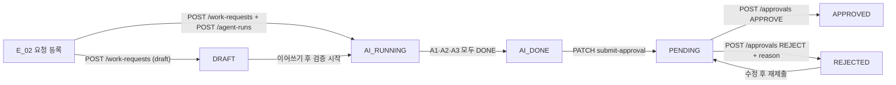

# WRA API 명세서 v1.1

> **REQ-F-0001 · 부품 교체 요청·승인 시스템 API 명세서**
> 기준 문서: WRA 화면정의서 v2.0 (9화면 · 2026-09-03) · 작성일 2026-09-03
> 화면정의서의 Acceptance Criteria 표에 명시된 API 컬럼을 1:1로 전개한 개발 착수용 스펙입니다.

| 항목 | 값 |
| --- | --- |
| 버전 | v1.1 |
| 최종 수정 | 2026-09-03 |
| 상태 | 개발 착수 기준 (Baseline) |
| 원본/논의 | [Notion 페이지](https://app.notion.com/p/WRA-API-v1-0-3d0a7f29102a816faf73df3d588eb3ca) |

---

## 목차

1. [공통 규약](#1-공통-규약)
2. [도메인 Enum](#2-도메인-enum)
3. [상태 전이 & 엔드투엔드 흐름](#3-상태-전이--엔드투엔드-흐름)
4. [API 목록 (요약)](#4-api-목록-요약)
5. [API 상세](#5-api-상세)
6. [화면 ↔ API 매트릭스](#6-화면--api-매트릭스)
7. [DB 매핑](#7-db-매핑)
8. [HTTP 상태 코드 · 에러 코드 정리](#8-http-상태-코드--에러-코드-정리)
9. [정합성 메모 · 팀 확인 필요 사항](#9-정합성-메모--팀-확인-필요-사항)

---

## 1. 공통 규약

| 항목 | 규약 |
| --- | --- |
| **Base URL** | `/api/v1` |
| **인증** | JWT Bearer — `Authorization: Bearer {accessToken}`. `/auth/signup`, `/auth/login` 제외 전 API 필수 |
| **Content-Type** | `application/json; charset=utf-8` (사진 업로드만 `multipart/form-data`) |
| **시각 포맷** | ISO 8601 · KST 오프셋 포함 — `2026-09-03T10:22:00+09:00` |
| **ID 포맷** | UUID v4 문자열 |
| **페이지네이션** | 쿼리 `page` (0-base, 기본 0) · `size` (기본 20, 최대 100). 응답에 `page` 객체 포함 |
| **정렬** | 쿼리 `sort=필드,asc\|desc` — 기본 `createdAt,desc` |
| **권한** | `ENGINEER`는 본인 요청만 조회·수정 / `SAFETY_MANAGER`는 `PENDING` 이상 요청 전체 조회·승인. 위반 시 403 |

### 1.1 공통 에러 응답

모든 4xx·5xx는 아래 단일 포맷으로 반환합니다.

```json
{
  "timestamp": "2026-09-03T10:22:31+09:00",
  "status": 422,
  "code": "SUBMIT_REQUIRED_FIELD_MISSING",
  "message": "엔지니어 설명은 제출 시 필수입니다.",
  "path": "/api/v1/work-requests/9f1c.../submit-approval",
  "fieldErrors": [
    { "field": "engineerNote", "reason": "must not be blank" }
  ]
}
```

> ℹ️ `fieldErrors`는 입력 유효성 오류(400·422)에서만 포함되고, 그 외에는 생략됩니다.

---

## 2. 도메인 Enum

### 2.1 Role — 사용자 역할

| 값 | 화면 표기 | 진입 화면 |
| --- | --- | --- |
| `ENGINEER` | 엔지니어 | WRA_E_01 `/home` |
| `SAFETY_MANAGER` | 안전관리자 | WRA_S_01 `/manage/requests` |

### 2.2 WorkRequestStatus — 요청 상태

| 값 | 화면 표기 | 의미 | 다음 액션 |
| --- | --- | --- | --- |
| `DRAFT` | 작성 중 | 임시 저장, AI 미실행 | E_02 이어쓰기 |
| `AI_RUNNING` | AI 검증중 | 에이전트 3종 중 미완료 존재 | E_03 진행 화면 |
| `AI_DONE` | 결과 확인 대기 | A1·A2·A3 전부 완료, 미제출 | E_04 결과 수정 |
| `PENDING` | 승인 대기 | 안전관리자에게 제출됨 | S_02 검토 |
| `APPROVED` | 승인 | 안전관리자 승인 완료 | 종결 |
| `REJECTED` | 거절·보완 | 사유와 함께 반려 | E_04 재진입 → 재제출 |

### 2.3 ProductType — 제품 유형과 동적 스펙

`specJson`은 `productType`에 따라 필수 키가 달라지는 자유 객체입니다. 서버는 유형별 스키마로 검증합니다.

| `productType` | 화면 표기 | `specJson` 필수 키 | 예시 |
| --- | --- | --- | --- |
| `VALVE` | 밸브 | `pressureRating` | `{"pressureRating":"3000 psi"}` |
| `FITTING_TUBE` | 피팅·튜브 | `connectionStandard`, `material` | `{"connectionStandard":"1/4 in VCR","material":"SUS316L"}` |
| `REGULATOR` | 레귤레이터 | `pressureRating` | `{"pressureRating":"250 psi"}` |
| `FILTER` | 필터 | `substanceType` | `{"substanceType":"N2"}` |
| `ETC` | 기타 | `freeSpec` (자유 문자열) | `{"freeSpec":"씰킷 세트, 내열 200℃"}` |

### 2.4 AgentCode · AgentStepStatus · ApprovalDecision

**AgentCode** (3종 전부 PoC 구현)

- `A1` — 규격·호환 (입력 스펙 기반)
- `A2` — 법령·조문
- `A3` — 안전서류(허가서·위험성평가)

> 🚧 A1 부품 마스터·호환표 연동, A4 벤더 에이전트는 **Phase 2**

**AgentStepStatus**

- `WAITING` — 대기
- `RUNNING` — 실행 중
- `DONE` — 완료
- `FAILED` — 실패(재시도 대상)

**ApprovalDecision**

- `APPROVE` — 승인
- `REJECT` — 거절 (`reason` 필수)

---

## 3. 상태 전이 & 엔드투엔드 흐름



| 단계 | 화면 | 호출 API |
| --- | --- | --- |
| 1. 요청 등록 | WRA_E_02 | `POST /work-requests` → `POST /agent-runs` |
| 2. AI 검증 3종 | WRA_E_03 | `GET /agent-runs/{runId}` (2~3초 폴링) |
| 3. 결과 수정 + 설명 | WRA_E_04 | `PATCH /agent-results/{id}` · `PATCH /work-requests/{id}` |
| 4. 제출 | WRA_E_04 | `PATCH /work-requests/{id}/submit-approval` |
| 5. 요청 관리 | WRA_S_01 | `GET /work-requests?status=PENDING` |
| 6. 상세 확인 | WRA_S_02 | `GET /work-requests/{id}` |
| 7. 승인 / 거절 | WRA_S_02 | `POST /approvals` |

---

## 4. API 목록 (요약)

> 1~15는 화면정의서 AC에서 직접 전개한 것이고, **16 로그아웃은 v1.1에서 추가**했습니다. 화면정의서에는 없지만 GNB에 로그아웃이 필요해 신설했습니다 (9절 #11).

| # | Method | Path | 설명 | 화면 | 권한 |
| --- | --- | --- | --- | --- | --- |
| 1 | POST | `/auth/signup` | 회원가입 (역할 선택 필수) | C_01 | 공개 |
| 2 | POST | `/auth/login` | 로그인 · 역할 반환 | C_00 | 공개 |
| 3 | GET | `/auth/me` | 토큰 소유자 정보 조회 | 공통 | 인증 |
| 4 | GET | `/dashboard/summary` | 역할별 KPI + 거절 사유 TOP5 | E_01, S_01 | 인증 |
| 5 | POST | `/work-requests` | 요청 생성 (임시저장 / 정식) | E_02 | ENGINEER |
| 6 | GET | `/work-requests` | 요청 목록 (mine · status 필터) | E_01, E_05, S_01 | 인증 |
| 7 | GET | `/work-requests/{id}` | 요청 상세 (AI 결과·승인 이력 포함) | E_04, E_05, S_02 | 인증 |
| 8 | PATCH | `/work-requests/{id}` | 요청 수정 · 엔지니어 설명 저장 | E_02, E_04 | ENGINEER |
| 9 | POST | `/work-requests/{id}/photos` | 제품 사진 업로드 | E_02 | ENGINEER |
| 10 | GET | `/work-requests/{id}/photos` | 제품 사진 목록·원본 URL | S_02 | 인증 |
| 11 | POST | `/agent-runs` | AI 검증 3종 실행 요청 (비동기) | E_02 | ENGINEER |
| 12 | GET | `/agent-runs/{runId}` | 에이전트 진행 상태 폴링 | E_03 | 인증 |
| 13 | PATCH | `/agent-results/{id}` | AI 결과물 수정 (규격·법령·안전서류) | E_04 | ENGINEER |
| 14 | PATCH | `/work-requests/{id}/submit-approval` | 안전관리자에게 제출 → PENDING | E_04 | ENGINEER |
| 15 | POST | `/approvals` | 승인 / 거절 + 사유 | S_02 | SAFETY_MANAGER |
| 16 | POST | `/auth/logout` | 현재 토큰 무효화 | 공통 GNB | 인증 |

---

## 5. API 상세

### 5.1 POST /auth/signup — 회원가입

**AC 매핑:** 1-4 (201) · 1-5 (409) · 1-2 / 1-3 (400)

**Request**

```json
{
  "name": "홍길동",
  "email": "hong@company.com",
  "password": "Passw0rd!23",
  "passwordConfirm": "Passw0rd!23",
  "role": "ENGINEER"
}
```

| 필드 | 타입 | 필수 | 제약 |
| --- | --- | --- | --- |
| `name` | string | Y | 2~20자 |
| `email` | string | Y | 이메일 형식 · 유니크 |
| `password` | string | Y | 8자 이상, 영문+숫자+특수문자 |
| `passwordConfirm` | string | Y | `password`와 일치 |
| `role` | enum | Y | `ENGINEER` \| `SAFETY_MANAGER` |

**Response 201**

```json
{
  "userId": "8b0d2f14-6c2e-4a71-9d33-1e5a7c9b0f22",
  "name": "홍길동",
  "email": "hong@company.com",
  "role": "ENGINEER",
  "createdAt": "2026-09-03T09:12:00+09:00"
}
```

**오류**

| 상태 | code | 상황 |
| --- | --- | --- |
| 400 | `VALIDATION_FAILED` | 필수 항목·역할 미선택 (AC 1-2) |
| 400 | `PASSWORD_MISMATCH` | 비밀번호 ≠ 확인 (AC 1-3) |
| 409 | `EMAIL_ALREADY_EXISTS` | 중복 이메일 (AC 1-5) |

---

### 5.2 POST /auth/login — 로그인

**AC 매핑:** 0-2 (200 · 역할 분기) · 0-3 (401)

**Request**

```json
{ "email": "hong@company.com", "password": "Passw0rd!23" }
```

**Response 200**

```json
{
  "accessToken": "eyJhbGciOiJIUzI1NiJ9...",
  "tokenType": "Bearer",
  "expiresIn": 3600,
  "user": {
    "userId": "8b0d2f14-6c2e-4a71-9d33-1e5a7c9b0f22",
    "name": "홍길동",
    "role": "ENGINEER"
  },
  "redirectPath": "/home"
}
```

> 🔀 **역할 분기 규칙 (AC 0-2)** — `role=ENGINEER` → `redirectPath: "/home"` (E_01), `role=SAFETY_MANAGER` → `redirectPath: "/manage/requests"` (S_01). 프론트는 이 값을 그대로 사용합니다.

**오류** — 401 `INVALID_CREDENTIALS` (자격 증명 불일치, 진입 차단)

---

### 5.3 GET /auth/me — 내 정보 조회

새로고침·직접 URL 진입 시 역할 확인용. 화면정의서에는 없지만 역할별 GNB 렌더링에 필요합니다.

**Response 200**

```json
{ "userId": "8b0d...", "name": "홍길동", "email": "hong@company.com", "role": "ENGINEER" }
```

**오류** — 401 `TOKEN_EXPIRED` / `TOKEN_INVALID`

---

### 5.4 GET /dashboard/summary — 역할별 대시보드 요약

**AC 매핑:** 2-1 (엔지니어 KPI) · 7-1 / 7-3 (안전관리자 KPI + 거절 사유 TOP5)

**Query**

| 파라미터 | 타입 | 필수 | 설명 |
| --- | --- | --- | --- |
| `role` | enum | Y | `engineer` \| `safety` — 토큰 역할과 불일치 시 403 |

**Response 200 — `role=engineer`**

```json
{
  "role": "ENGINEER",
  "kpi": {
    "draft": 2,
    "aiRunning": 1,
    "pending": 3,
    "rejected": 1
  }
}
```

> 🚫 **v2.0에서 제거** — 엔지니어 KPI의 `평균 승인 소요시간`과 요약 테이블의 `에이전트 진행률` 컬럼은 응답에 포함하지 않습니다.

**Response 200 — `role=safety`**

```json
{
  "role": "SAFETY_MANAGER",
  "kpi": {
    "pending": 5,
    "processedToday": 7,
    "approvedThisMonth": 42,
    "rejectedThisMonth": 6
  },
  "rejectReasonTop5": [
    { "category": "규격 부적합", "count": 9 },
    { "category": "법령 미충족", "count": 7 },
    { "category": "안전서류 미흡", "count": 5 },
    { "category": "설명 불충분", "count": 3 },
    { "category": "운전 조건 불일치", "count": 2 }
  ]
}
```

---

### 5.5 POST /work-requests — 요청 생성

**AC 매핑:** 3-5 (201 정식 생성) · 3-6 (DRAFT 임시 저장) · 3-3 (400 필수 누락)

**Request**

```json
{
  "equipment": "펌프 P-114",
  "line": "A라인",
  "substance": "H2SO4",
  "operatingCondition": { "temperature": "80 ℃", "pressure": "2500 psi" },
  "productName": "SS-8-VCR",
  "productType": "VALVE",
  "specJson": { "pressureRating": "3000 psi" },
  "symptom": "씰 누유 발생, 압력 유지 불가",
  "siteMemo": "09-02 정기점검 중 확인",
  "draft": false
}
```

| 필드 | 타입 | 필수 | 설명 |
| --- | --- | --- | --- |
| `equipment` | string | Y* | 설비 (E_02 필수) |
| `line` | string | Y* | 라인 (E_02 필수) |
| `substance` | string | Y* | 취급 물질 |
| `operatingCondition` | object | Y* | `temperature`, `pressure` |
| `productName` | string | Y* | 제품명 — AI 전송 핵심 값 |
| `productType` | enum | Y* | 2.3 참조 |
| `specJson` | object | Y* | `productType`별 스키마 검증 |
| `symptom` | string | N | 고장 증상 |
| `siteMemo` | string | N | 현장 확인 메모 |
| `draft` | boolean | N | `true`면 상태 `DRAFT`로 저장하고 필수 검증 생략 (기본 `false`) |

> ⚠️ `Y*` = `draft=false`일 때만 필수. `draft=true`(임시 저장)는 모든 필드가 선택이며 상태만 `DRAFT`로 기록합니다. (AC 3-6)

**Response 201**

```json
{
  "workRequestId": "9f1c8a02-77b5-4e0a-9c31-2a4d6f8e1b30",
  "status": "DRAFT",
  "createdAt": "2026-09-03T10:05:00+09:00"
}
```

**오류** — 400 `VALIDATION_FAILED` (필수 누락) · 400 `SPEC_SCHEMA_MISMATCH` (`productType`과 `specJson` 키 불일치)

---

### 5.6 GET /work-requests — 요청 목록

**AC 매핑:** 2-2 (엔지니어 최근 요청) · 6-1 / 6-2 (내 요청 탭 필터) · 7-2 (안전관리자 승인 대기)

**Query**

| 파라미터 | 타입 | 기본 | 설명 |
| --- | --- | --- | --- |
| `mine` | boolean | false | `true`면 본인 요청만 (엔지니어 전용) |
| `status` | enum | — | 2.2 값. 다중 지정 시 콤마 구분 (`REJECTED,DRAFT`) |
| `page` / `size` | int | 0 / 20 | 페이지네이션 |
| `sort` | string | `submittedAt,desc` | 정렬 |

**Response 200**

```json
{
  "content": [
    {
      "workRequestId": "9f1c8a02-...",
      "equipment": "펌프 P-114",
      "partName": "밸브 V-2",
      "productType": "VALVE",
      "productTypeLabel": "밸브",
      "status": "PENDING",
      "statusLabel": "승인 대기",
      "requesterName": "이엔지",
      "submittedAt": "2026-09-03T10:22:00+09:00",
      "nextAction": { "label": "상세", "path": "/manage/requests/9f1c8a02-..." }
    }
  ],
  "page": { "number": 0, "size": 20, "totalElements": 5, "totalPages": 1 }
}
```

> 🧭 `nextAction`은 AC 2-4 / 6-5(상태별 화면 이동)를 서버가 계산해 내려주는 값입니다. `DRAFT` → 이어서(E_02) · `AI_RUNNING` → 진행(E_03) · `AI_DONE` → 결과(E_04) · 그 외 → 상세.

**빈 목록** — 200에 `content: []`. 안전관리자 화면은 이때 "승인 대기 요청이 없습니다" 안내를 표시합니다. (AC 7-5)

---

### 5.7 GET /work-requests/{id} — 요청 상세

**AC 매핑:** 4-4 · 5-1 · 6-3 (거절 사유 열람) · 6-5 · 8-1

**Response 200**

```json
{
  "workRequestId": "9f1c8a02-...",
  "status": "PENDING",
  "requester": { "userId": "8b0d...", "name": "이엔지" },
  "equipment": "펌프 P-114",
  "line": "A라인",
  "substance": "H2SO4",
  "operatingCondition": { "temperature": "80 ℃", "pressure": "2500 psi" },
  "productName": "V-2",
  "productType": "VALVE",
  "specJson": { "pressureRating": "3000 psi" },
  "symptom": "씰 누유 발생",
  "siteMemo": "09-02 정기점검 중 확인",
  "engineerNote": "압력 등급 상향 반영, 제38조 작업허가 필요 판단. 대체품 SS-8-VCR-2 확인 완료.",
  "photos": [
    { "photoId": "c31a...", "fileName": "valve_front.jpg", "thumbnailUrl": "https://.../thumb/c31a.jpg", "originalUrl": "https://.../origin/c31a.jpg" }
  ],
  "agentRun": {
    "runId": "5e77...",
    "status": "DONE",
    "results": [
      {
        "agentResultId": "a1-4d2f...",
        "agentCode": "A1",
        "title": "규격·호환",
        "editable": true,
        "items": [
          { "itemId": "i-01", "text": "규격 적합: 3000 psi ≥ 요구 2500 psi", "edited": false },
          { "itemId": "i-02", "text": "대체 호환: SS-8-VCR-2", "edited": true }
        ]
      },
      {
        "agentResultId": "a2-9c10...",
        "agentCode": "A2",
        "title": "적용 법령",
        "editable": true,
        "items": [
          { "itemId": "i-03", "text": "산업안전보건기준에 관한 규칙 제38조", "edited": false },
          { "itemId": "i-04", "text": "고압가스 안전관리법 제20조", "edited": false }
        ]
      },
      {
        "agentResultId": "a3-2b88...",
        "agentCode": "A3",
        "title": "안전서류 초안",
        "editable": true,
        "documents": [
          { "docId": "d-01", "type": "WORK_PERMIT", "name": "작업허가서 초안", "content": "...", "edited": false },
          { "docId": "d-02", "type": "RISK_ASSESSMENT", "name": "위험성평가서 초안", "content": "...", "edited": false }
        ]
      }
    ]
  },
  "approval": {
    "decision": "REJECT",
    "reason": "규격 근거 자료 부족 — 호환표 첨부 요망",
    "decidedBy": "박안전",
    "decidedAt": "2026-09-02T18:40:00+09:00"
  },
  "createdAt": "2026-09-03T10:05:00+09:00",
  "submittedAt": "2026-09-03T10:22:00+09:00"
}
```

> 👀 **역할별 노출 차이** — `SAFETY_MANAGER`가 조회하면 `agentRun.results[*].editable`은 항상 `false`로 내려갑니다 (S_02는 읽기 전용). `approval`은 미처리 시 `null`.

**오류** — 403 `FORBIDDEN_NOT_OWNER` (타인 요청 조회) · 404 `WORK_REQUEST_NOT_FOUND`

---

### 5.8 PATCH /work-requests/{id} — 요청 수정 · 엔지니어 설명 저장

**AC 매핑:** 5-3 (엔지니어 설명 저장) · 6-5 (DRAFT 이어쓰기 저장)

**Request** — 변경할 필드만 전송 (부분 수정)

```json
{ "engineerNote": "압력 등급 상향 반영, 제38조 작업허가 필요 판단." }
```

수정 가능 필드: `equipment`, `line`, `substance`, `operatingCondition`, `productName`, `productType`, `specJson`, `symptom`, `siteMemo`, `engineerNote`

**Response 200** — 수정된 요청 요약 반환

```json
{ "workRequestId": "9f1c8a02-...", "status": "AI_DONE", "updatedAt": "2026-09-03T10:20:11+09:00" }
```

**오류** — 409 `IMMUTABLE_STATUS` (`PENDING`·`APPROVED` 상태에서는 수정 불가) · 403 `FORBIDDEN_NOT_OWNER`

---

### 5.9 POST /work-requests/{id}/photos — 제품 사진 업로드

**AC 매핑:** 3-4 (썸네일 표시 · 첨부 목록 추가)

**Request** — `multipart/form-data`

| 파트 | 타입 | 필수 | 제약 |
| --- | --- | --- | --- |
| `files` | file[] | Y | jpg/png/webp · 파일당 10MB · 요청당 최대 5장 |

> 📷 화면정의서 기준 **제품 사진**입니다(현장 사진 아님). 업로드 시 EXIF는 제거하고 썸네일(320px)을 함께 생성합니다.

**Response 201**

```json
{
  "photos": [
    { "photoId": "c31a...", "fileName": "valve_front.jpg", "size": 842113, "thumbnailUrl": "https://.../thumb/c31a.jpg", "originalUrl": "https://.../origin/c31a.jpg" }
  ]
}
```

**오류** — 400 `UNSUPPORTED_FILE_TYPE` · 413 `FILE_TOO_LARGE` · 409 `PHOTO_LIMIT_EXCEEDED`

---

### 5.10 GET /work-requests/{id}/photos — 제품 사진 열람

**AC 매핑:** 8-5 (썸네일 클릭 → 원본 열람)

**Response 200**

```json
{
  "photos": [
    { "photoId": "c31a...", "fileName": "valve_front.jpg", "thumbnailUrl": "https://.../thumb/c31a.jpg", "originalUrl": "https://.../origin/c31a.jpg", "uploadedAt": "2026-09-03T10:10:00+09:00" }
  ]
}
```

---

### 5.11 POST /agent-runs — AI 검증 3종 실행

**AC 매핑:** 3-5 (202) · 4-1

> 🤖 **AI 입력 원칙 (화면정의서 명시)** — 엔지니어가 입력한 **전체 컨텍스트**(설비/라인/물질/운전 조건/제품명/제품 유형/스펙/사진 메타)를 에이전트로 전송합니다. 서버가 `workRequestId`로 전체 스냅샷을 구성하므로 프론트는 ID만 보냅니다.

**Request**

```json
{ "workRequestId": "9f1c8a02-...", "agents": ["A1", "A2", "A3"] }
```

**Response 202**

```json
{
  "runId": "5e77b1c9-...",
  "workRequestId": "9f1c8a02-...",
  "status": "RUNNING",
  "steps": [
    { "agentCode": "A1", "status": "WAITING" },
    { "agentCode": "A2", "status": "WAITING" },
    { "agentCode": "A3", "status": "WAITING" }
  ],
  "pollIntervalMs": 2500
}
```

**오류** — 409 `RUN_ALREADY_IN_PROGRESS` (동일 요청에 진행 중인 run 존재) · 400 `WORK_REQUEST_INCOMPLETE`

---

### 5.12 GET /agent-runs/{runId} — 진행 상태 폴링

**AC 매핑:** 4-1 · 4-2 (2~3초 폴링, 대기→실행중→완료) · 4-3 (3종 완료 시 결과 확인 활성화)

**Response 200**

```json
{
  "runId": "5e77b1c9-...",
  "workRequestId": "9f1c8a02-...",
  "status": "RUNNING",
  "startedAt": "2026-09-03T10:06:02+09:00",
  "steps": [
    {
      "agentCode": "A1",
      "title": "규격·호환",
      "status": "DONE",
      "message": "입력 스펙(3000 psi) 기준 규격 적합 — 근거 2건",
      "agentResultId": "a1-4d2f...",
      "finishedAt": "2026-09-03T10:06:20+09:00"
    },
    { "agentCode": "A2", "title": "법령", "status": "RUNNING", "message": "관련 조문 검색 중…" },
    { "agentCode": "A3", "title": "안전서류", "status": "WAITING", "message": "허가서·위험성평가 생성 예정" }
  ],
  "allDone": false,
  "pollIntervalMs": 2500
}
```

> ✅ `allDone: true`가 되는 시점에 프론트는 폴링을 중단하고 **[결과 확인]** 버튼을 활성화합니다 (AC 4-3). 이때 `work_requests.status`는 서버가 `AI_DONE`으로 전환합니다.

**오류** — 404 `AGENT_RUN_NOT_FOUND` · 스텝 실패 시 해당 step `status: "FAILED"` + `errorMessage` 포함(200 유지)

---

### 5.13 PATCH /agent-results/{id} — AI 결과물 수정

**AC 매핑:** 5-2 (법령·항목 추가/삭제/편집 → 저장, 결과 갱신)

**Request — A1 / A2 (항목형)**

```json
{
  "items": [
    { "itemId": "i-01", "text": "규격 적합: 3000 psi ≥ 요구 2500 psi" },
    { "itemId": "i-02", "text": "대체 호환: SS-8-VCR-2 (벤더 확인 완료)" },
    { "text": "추가 근거: 사내 표준 STD-VLV-07" }
  ]
}
```

> 🧩 **전체 치환(PUT-like) 방식** — 배열에 없는 기존 `itemId`는 **삭제**로 처리합니다. `itemId` 없이 `text`만 보내면 신규 추가입니다. (AC 5-2의 추가·삭제·편집을 한 번의 호출로 처리)

**Request — A3 (문서형)**

```json
{
  "documents": [
    { "docId": "d-01", "content": "작업허가서 초안 본문 (수정됨)…" },
    { "docId": "d-02", "content": "위험성평가서 초안 본문…" }
  ]
}
```

**Response 200**

```json
{
  "agentResultId": "a2-9c10...",
  "agentCode": "A2",
  "edited": true,
  "items": [ { "itemId": "i-03", "text": "산업안전보건기준에 관한 규칙 제38조", "edited": false } ],
  "updatedAt": "2026-09-03T10:19:40+09:00"
}
```

**오류** — 409 `RESULT_LOCKED` (`PENDING`·`APPROVED` 상태에서는 결과 수정 불가) · 403 `FORBIDDEN_NOT_OWNER`

---

### 5.14 PATCH /work-requests/{id}/submit-approval — 안전관리자에게 제출

**AC 매핑:** 5-4 (200 · PENDING 전환) · 5-5 (422 누락 차단) · 6-4 (재제출)

> 🔗 화면정의서 AC에는 `PATCH /submit-approval`로 표기되어 있습니다. 대상 요청 식별이 필요하므로 실제 경로는 `PATCH /work-requests/{id}/submit-approval`로 확정합니다. **(정합성 메모 #1)**

**Request**

```json
{ "engineerNote": "압력 등급 상향 반영, 제38조 작업허가 필요 판단. 대체품 SS-8-VCR-2 확인 완료." }
```

**Response 200**

```json
{
  "workRequestId": "9f1c8a02-...",
  "status": "PENDING",
  "submittedAt": "2026-09-03T10:22:00+09:00"
}
```

**제출 전 서버 검증** (실패 시 422 `SUBMIT_REQUIRED_FIELD_MISSING`)

- [ ] 에이전트 3종(A1·A2·A3) 결과가 모두 존재
- [ ] `engineerNote`가 비어 있지 않음
- [ ] A2 적용 법령 항목이 1건 이상
- [ ] 요청 상태가 `AI_DONE` 또는 `REJECTED`

> 🔁 **재제출 (AC 6-4)** — `REJECTED` 상태에서 동일 API를 호출하면 상태가 `PENDING`으로 복귀하고, 직전 `approval` 이력은 보존한 채 새 승인 대기 건으로 노출됩니다.

---

### 5.15 POST /approvals — 승인 / 거절

**AC 매핑:** 8-2 (승인 201) · 8-3 (사유 미입력 차단) · 8-4 (거절 201 + 사유 전달)

**Request — 승인**

```json
{ "workRequestId": "9f1c8a02-...", "decision": "APPROVE" }
```

**Request — 거절**

```json
{
  "workRequestId": "9f1c8a02-...",
  "decision": "REJECT",
  "reason": "규격 근거 자료 부족 — 호환표 첨부 요망",
  "reasonCategory": "규격 부적합"
}
```

| 필드 | 타입 | 필수 | 설명 |
| --- | --- | --- | --- |
| `workRequestId` | uuid | Y | 대상 요청 |
| `decision` | enum | Y | `APPROVE` \| `REJECT` |
| `reason` | string | REJECT 시 Y | 10자 이상 — 요청자(E_05)에게 그대로 전달 |
| `reasonCategory` | string | N | 거절 사유 TOP5 집계용 (S_01) |

**Response 201**

```json
{
  "approvalId": "ap-7710...",
  "workRequestId": "9f1c8a02-...",
  "decision": "REJECT",
  "reason": "규격 근거 자료 부족 — 호환표 첨부 요망",
  "resultStatus": "REJECTED",
  "decidedBy": "박안전",
  "decidedAt": "2026-09-03T11:02:00+09:00"
}
```

**오류**

| 상태 | code | 상황 |
| --- | --- | --- |
| 400 | `REJECT_REASON_REQUIRED` | 거절인데 사유 미입력 — 처리 차단 (AC 8-3) |
| 403 | `FORBIDDEN_ROLE` | 엔지니어가 호출 |
| 409 | `ALREADY_DECIDED` | 이미 처리된 요청 |
| 409 | `NOT_PENDING` | `PENDING`이 아닌 상태 |

> ✅ 화면정의서 v2.0 기준 — 안전관리자 승인에는 **체크리스트 blocking이 없습니다**. 승인은 사유 없이 즉시 처리되고, 거절만 사유가 필수입니다.

---

### 5.16 POST /auth/logout — 로그아웃

**AC 매핑:** 없음 (화면정의서 미기재 · v1.1 신설 · 9절 #11)

현재 `Authorization` 헤더로 보낸 액세스 토큰을 **원래 만료 시각까지 블랙리스트에 등록**해 즉시 무효화합니다. 요청 본문은 없습니다.

**Request**

```
POST /api/v1/auth/logout
Authorization: Bearer {accessToken}
```

**Response 204** — 본문 없음

**오류**

| 상태 | code | 상황 |
| --- | --- | --- |
| 401 | `TOKEN_INVALID` | 토큰 없음·위조 |
| 401 | `TOKEN_EXPIRED` | 이미 만료된 토큰 |
| 401 | `TOKEN_REVOKED` | 이미 로그아웃된 토큰으로 재호출 |

> 🔑 **무효화 단위는 토큰 1개**입니다. 토큰마다 `jti`가 다르므로 한 기기에서 로그아웃해도 다른 기기의 세션은 유지됩니다. 계정 전체를 끊으려면 별도 기능이 필요합니다.

> 🧱 **저장소** — `jti`를 남은 유효시간만큼 TTL로 보관합니다. 운영은 Redis, 로컬·테스트는 인메모리 폴백을 쓰며 `app.auth.token-blacklist.type` 설정 하나로 전환됩니다. Redis를 켜면 **인증이 필요한 모든 요청이 Redis 조회 1회를 거치므로**, stateless JWT의 이점을 일부 반납하는 트레이드오프를 감수하는 선택입니다.

---

## 6. 화면 ↔ API 매트릭스

| Screen ID | 화면명 | Role | 호출 API |
| --- | --- | --- | --- |
| WRA_C_00 | 로그인 | 공통 | `POST /auth/login` |
| WRA_C_01 | 회원가입 | 공통 | `POST /auth/signup` |
| WRA_E_01 | 엔지니어 메인 | 엔지니어 | `GET /dashboard/summary?role=engineer` · `GET /work-requests?mine=true` · `GET /work-requests/{id}` |
| WRA_E_02 | 요청 등록 | 엔지니어 | `POST /work-requests` · `POST /work-requests/{id}/photos` · `POST /agent-runs` |
| WRA_E_03 | AI 검증 진행 | 엔지니어 | `GET /agent-runs/{runId}` (폴링) · `GET /work-requests/{id}` |
| WRA_E_04 | AI 결과 확인·수정 | 엔지니어 | `GET /work-requests/{id}` · `PATCH /agent-results/{id}` · `PATCH /work-requests/{id}` · `PATCH /work-requests/{id}/submit-approval` |
| WRA_E_05 | 내 요청 목록 | 엔지니어 | `GET /work-requests?mine=true&status=` · `GET /work-requests/{id}` · `PATCH /work-requests/{id}/submit-approval` |
| WRA_S_01 | 요청 관리 | 안전관리자 | `GET /dashboard/summary?role=safety` · `GET /work-requests?status=PENDING` |
| WRA_S_02 | 요청 상세(승인/거절) | 안전관리자 | `GET /work-requests/{id}` · `GET /work-requests/{id}/photos` · `POST /approvals` |

---

## 7. DB 매핑

화면정의서 `Connecting API & DB` 항목을 테이블 단위로 전개한 것입니다.

| 테이블 | 주요 컬럼 | 사용 API |
| --- | --- | --- |
| `users` | `id`, `name`, `email`(uniq), `password_hash`, `role`, `created_at` | 1, 2, 3 |
| `work_requests` | `id`, `requester_id`(FK users), `equipment`, `line`, `substance`, `operating_condition`(json), `product_name`, `product_type`, `spec_json`(json), `symptom`, `site_memo`, `engineer_note`, `status`, `created_at`, `submitted_at` | 5, 6, 7, 8, 14 |
| `work_request_photos` | `id`, `work_request_id`(FK), `file_name`, `storage_key`, `thumbnail_key`, `size`, `uploaded_at` | 9, 10 |
| `agent_runs` | `id`, `work_request_id`(FK), `status`, `started_at`, `finished_at` | 11, 12 |
| `agent_steps` | `id`, `run_id`(FK), `agent_code`, `status`, `message`, `error_message`, `started_at`, `finished_at` | 11, 12 |
| `agent_results` | `id`, `run_id`(FK), `agent_code`, `payload_json`(항목·문서), `edited`, `updated_at` | 7, 12, 13 |
| `approvals` | `id`, `work_request_id`(FK), `approver_id`(FK users), `decision`, `reason`, `reason_category`, `decided_at` | 15, 7 |

> 🗂️ `agent_results.payload_json`은 A1·A2가 `items[]`, A3가 `documents[]` 구조를 갖습니다. 재제출 이력을 남기려면 `approvals`는 요청당 다건(append-only)으로 두고, 최신 1건을 상세 응답의 `approval`에 노출합니다.

---

## 8. HTTP 상태 코드 · 에러 코드 정리

| 상태 | code | 발생 지점 |
| --- | --- | --- |
| 400 | `VALIDATION_FAILED` | 필수 항목 누락 (AC 1-2, 3-3) |
| 400 | `PASSWORD_MISMATCH` | 비밀번호 확인 불일치 (AC 1-3) |
| 400 | `SPEC_SCHEMA_MISMATCH` | `productType`과 `specJson` 키 불일치 |
| 400 | `REJECT_REASON_REQUIRED` | 거절 사유 미입력 (AC 8-3) |
| 400 | `UNSUPPORTED_FILE_TYPE` | 허용 외 이미지 확장자 |
| 401 | `INVALID_CREDENTIALS` | 로그인 실패 (AC 0-3) |
| 401 | `TOKEN_EXPIRED` / `TOKEN_INVALID` | 토큰 만료·위조 |
| 401 | `TOKEN_REVOKED` | 로그아웃된 토큰 사용 (5.16 · v1.1 신설) |
| 403 | `FORBIDDEN_ROLE` | 역할 불일치 (엔지니어의 승인 시도 등) |
| 403 | `FORBIDDEN_NOT_OWNER` | 타인 요청 접근 |
| 404 | `WORK_REQUEST_NOT_FOUND` | 요청 없음 |
| 404 | `AGENT_RUN_NOT_FOUND` | run 없음 |
| 409 | `EMAIL_ALREADY_EXISTS` | 중복 이메일 (AC 1-5) |
| 409 | `RUN_ALREADY_IN_PROGRESS` | 중복 AI 실행 |
| 409 | `IMMUTABLE_STATUS` / `RESULT_LOCKED` | 제출·승인 후 수정 시도 |
| 409 | `ALREADY_DECIDED` / `NOT_PENDING` | 중복 승인 처리 |
| 413 | `FILE_TOO_LARGE` | 10MB 초과 |
| 422 | `SUBMIT_REQUIRED_FIELD_MISSING` | 제출 전 검증 실패 (AC 5-5) |
| 500 | `INTERNAL_ERROR` | 서버 오류 |

---

## 9. 정합성 메모 · 팀 확인 필요 사항

> 🧾 화면정의서 v2.0을 API로 전개하면서 **명시되지 않아 확정한 항목**입니다. 개발 착수 전 팀에서 한 번 확인해주세요.

| # | 항목 | 확정 내용 / 확인 포인트 |
| --- | --- | --- |
| 1 | 제출 API 경로 | 화면정의서 표기 `PATCH /submit-approval` → 대상 식별을 위해 `PATCH /work-requests/{id}/submit-approval`로 확정 |
| 2 | `AI_DONE` 상태 신설 | 화면정의서에는 상태 문구만 있고 코드값이 없음. E_03(진행)과 E_04(결과 대기)를 구분하려면 별도 상태가 필요 → `AI_DONE` 추가 |
| 3 | `GET /auth/me` 신설 | AC에는 없으나 새로고침 시 역할별 GNB 렌더링에 필요 |
| 4 | `nextAction` 서버 계산 | AC 2-4 / 6-5의 "상태별 화면 이동"을 프론트 분기 대신 서버가 내려주는 방식으로 설계. 프론트 분기로 바꿔도 무방 |
| 5 | 결과 수정 = 전체 치환 | `PATCH /agent-results/{id}`를 항목 배열 전체 치환으로 설계(추가·삭제·편집 1회 처리). 항목 단위 API로 쪼갤지 확인 |
| 6 | 거절 사유 카테고리 | S_01의 "거절 사유 TOP5" 집계를 위해 `reasonCategory`를 선택 입력으로 추가. 고정 5종 enum으로 굳힐지 자유 입력으로 둘지 확인 필요 |
| 7 | 사진 업로드 시점 | `POST /work-requests/{id}/photos`는 요청 생성 이후 호출 구조. E_02에서 저장 전에 사진을 먼저 올리려면 `DRAFT` 선생성이 전제 |
| 8 | 재제출 이력 | `approvals`를 append-only 다건으로 두고 최신 1건만 노출하도록 설계. 단건 갱신으로 갈지 확인 |
| 9 | 폴링 주기 | 서버가 `pollIntervalMs: 2500` 내려주는 방식(화면정의서 2~3초). SSE/WebSocket 전환은 Phase 2 |
| 10 | Phase 2 범위 | A1 부품 마스터·호환표 연동, A4 벤더 에이전트는 이번 스펙에서 제외 |
| 11 | 로그아웃 신설 | 화면정의서 AC에 없으나 GNB에 필요. **Redis 블랙리스트 방식으로 확정**(팀 결정). 대안이던 "클라이언트 토큰 폐기"는 즉시 무효화가 안 되고, "refresh 토큰"은 토큰 재발급 흐름이 추가됨. Redis 인프라 준비 전까지는 인메모리 폴백으로 동작 |

---

**출처** — WRA 화면정의서 v2.0 (9화면 · REQ-F-0001 · 2026-09-03). AI 검증 3종(규격·법령·안전서류) 구현 · 안전관리자 승인은 체크리스트 blocking 없이 승인/거절+사유.
